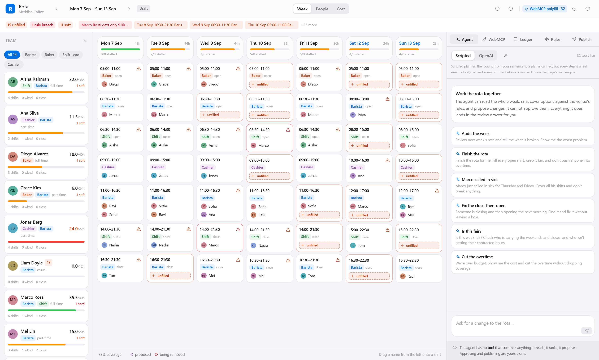
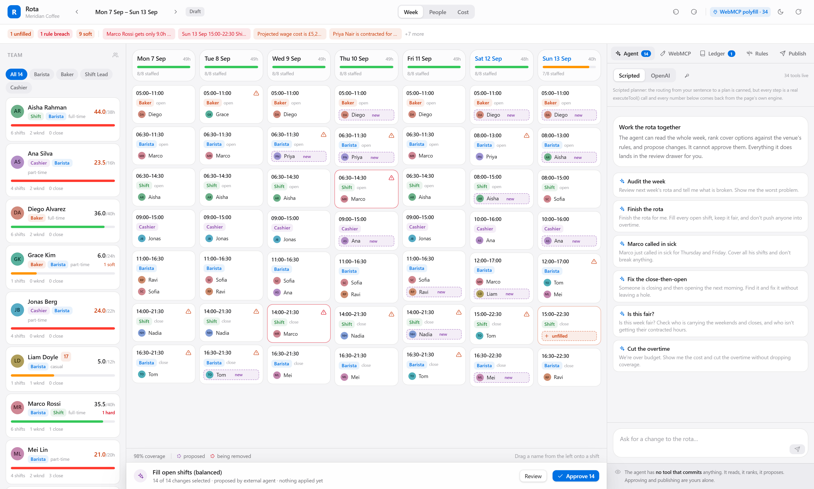
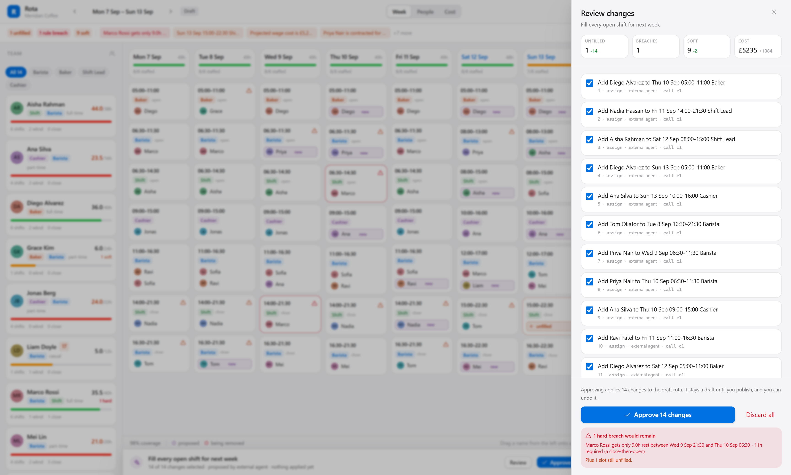
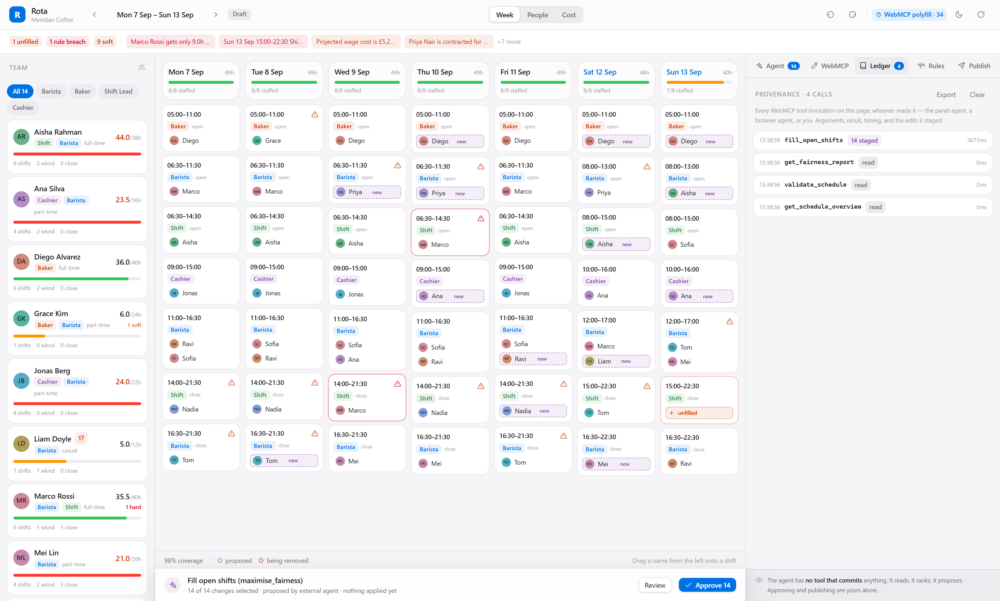

# Rota

**An agent does the grind. A human stays in charge.**

Rota is a shift-scheduling studio for a small business, built on [WebMCP](https://github.com/webmachinelearning/webmcp). A manager and an AI agent work the same roster at the same time, in the same tab, looking at the same grid. The agent can read the whole week, rank cover options against the venue's actual rules, and propose an entire rota in a dozen tool calls.

It cannot change a single person's Saturday without the manager pressing Approve.

That constraint is the project. Not a safety disclaimer bolted on afterwards — the architecture. There is no `commit`, `approve` or `publish` tool anywhere in the 36-tool surface, and the publish action is a declarative WebMCP form deliberately missing `toolautosubmit`, so the browser fills it and then stops, focuses the button, and waits for a person.



---

## Why scheduling, and why in the browser

Rostering a fourteen-person café is a genuinely hard combinatorial problem wrapped in a genuinely human one. Every week a manager has to satisfy statutory rest periods, availability windows, role certifications, under-18 curfews, weekly hour caps and consecutive-day limits — while also being *fair*, staying inside a wage budget, and honouring the fact that Priya has school pickup at 16:30 and Jonas coaches football on Saturdays.

Nobody does this well by hand. The failure mode in the demo data is the one every real rota has: someone closes at 21:30 on Wednesday and opens at 06:30 on Thursday. Nine hours of rest where eleven are required. It is invisible to the eye because both shifts look perfectly reasonable on their own.

This is close to ideal work for an agent — and close to ideal work for **WebMCP specifically**, for four reasons:

1. **The state is in the tab.** The roster, the staff records, the rule engine and the solver are all client-side. A backend MCP server would have to replicate the manager's live working state, half of which is uncommitted.
2. **The rules must not be hallucinated.** The agent never reasons about labour law. It calls `validate_schedule` and quotes what the page's own engine returns. When `assign_staff` refuses, the refusal is a fact — *"Liam Doyle is not certified as Baker"* — that the manager can act on.
3. **The agent and the human need shared visual context.** When the agent says "Thursday is the problem", it calls `highlight` and *puts Thursday on the manager's screen*, ringed in amber. No backend integration can do that.
4. **Approval is the whole game.** A schedule is a promise to fourteen people about their week. The interesting engineering question is not "can an agent build a rota" but "how does an agent build a rota that a human can actually check, amend and take responsibility for".

## Try it

**Live: https://shaikhmubin02.github.io/rota-webmcp/**

No sign-up, no API key, nothing to install. Two ways in:

| | |
| --- | --- |
| **Any browser** | Rota ships a WebMCP polyfill and its own in-page agent, so the whole thing works on stock Chrome, Firefox or Safari. Click a suggested prompt in the Agent panel. |
| **ChatGPT Desktop, Chrome 149+ or Edge 150+** | `document.modelContext` is native, so an *external* agent discovers the same 36 tools and drives the page directly. The badge in the toolbar tells you which mode you are in. |

Things worth asking for:

- **"Review next week's rota and tell me what is broken."** Finds the close-then-open nobody saw, and highlights it.
- **"Finish the rota. Keep it fair and don't push anyone into overtime."** Fills 14 of the 15 open slots, then tells you the fifteenth is impossible and exactly why.
- **"Marco called in sick for Thursday and Friday."** Pulls him off four shifts, records the absence, backfills all of it, re-checks the rules.
- **"Is this week fair?"** Notices that Ravi is on 6 of his 20 contracted hours because a hand-built rota always forgets the new hire.
- **"We're over budget."** Same problem, `minimise_cost` objective: £759 of added wage cost instead of £1,384.

For open-ended prompts, paste an OpenAI key into the panel (it stays in `localStorage`; there is no backend to send it to). Without a key, a scripted planner routes your sentence to a plan — the routing is canned, but every step is a real `executeTool()` call and every number is computed by the page.

## What the agent actually does



Ask it to finish the rota and it makes something like this sequence:

```
get_coverage_gaps          → 15 unfilled slots across 15 shifts
fill_open_shifts           → runs the solver, stages 14 assignments, £1,384
validate_schedule          → 2 breaches remain, both explained
get_labor_cost             → £5,235 of a £5,000 budget
request_approval           → opens the drawer. Stops. Waits.
```

Nothing on the calendar has changed yet. The proposed assignments render *in place* as dashed purple ghosts, so you review the change against the thing it changes rather than reading a list and imagining the result.



The drawer is the consent surface: every edit as a line you can untick, the net effect on coverage, breaches, soft issues and cost, and an honest warning about what your approval would leave unfixed. Each edit carries provenance — which tool call produced it, and which agent made that call.

## How this uses WebMCP

<table>
<tr><th align="left">Spec feature</th><th align="left">How Rota uses it</th></tr>
<tr><td><code>registerTool()</code></td><td>36 imperative tools across four groups. Full JSON Schema on every one, and descriptions written for a model to read rather than a changelog.</td></tr>
<tr><td><code>annotations.readOnlyHint</code></td><td>Set on all 14 read tools and none of the write tools. Surfaced in the UI so you can see at a glance which calls could have changed something.</td></tr>
<tr><td><code>getTools()</code></td><td>The in-page agent holds <em>no references</em> to its own tool functions. It discovers them like any external agent would, so our demo exercises the same code path a browser agent takes.</td></tr>
<tr><td><code>executeTool()</code></td><td>Every invocation goes through it — the panel agent, the scripted planner, and the manual "Run tool" button in the inspector.</td></tr>
<tr><td><code>toolchange</code></td><td>Load-bearing, not decorative. Select a shift and <code>selected_shift_cover_options</code> and <code>fill_selected_shift</code> appear. Stage a proposal and <code>revise_proposal</code> and <code>describe_pending_changes</code> appear. Deselect and they are withdrawn. A flat backend tool list cannot do this.</td></tr>
<tr><td><code>AbortSignal</code></td><td>Registration lifetime is signal-scoped, which is how contextual tools are withdrawn. Execution is cancellable — the Stop button aborts the in-flight call.</td></tr>
<tr><td><code>exposedTo</code> / <code>fromOrigins</code></td><td>Implemented and configurable from the WebMCP panel, so tools can be shared with a named secure origin (an author-provided agent in an iframe).</td></tr>
<tr><td>Declarative API</td><td><code>toolname</code>, <code>tooldescription</code>, <code>toolparamdescription</code> on the publish form, with the input schema compiled from the form's controls. <code>toolautosubmit</code> is deliberately absent.</td></tr>
<tr><td><code>Permissions-Policy: tools</code></td><td>Sent as <code>tools=(self)</code> in <a href="vercel.json"><code>vercel.json</code></a>.</td></tr>
</table>

Full reference, generated from the source: **[TOOLS.md](TOOLS.md)**.

### Three things we did that turned out to matter

**Tools return prose, not JSON.** The text half of every result is written as something you would be happy to read aloud. This is what the model reasons over and quotes back, and it changed answer quality more than any prompt engineering did. `find_cover` returns *"Mei Lin — score 88, no overtime incurred, prefers evenings"*, not a scored tuple.

**Arguments are coerced, not rejected.** Models send `"3"` for an integer, `"Thursday"` for a date, a bare string where an array is declared. Rejecting that is technically correct and practically useless — the agent burns a turn apologising. [`schema.ts`](src/webmcp/schema.ts) coerces what is unambiguously coercible and reports what it did, so the adjustment appears in the ledger instead of happening invisibly.

**Errors are results, not exceptions.** A model that receives *"Marco is not certified as Baker"* recovers on its next turn. One that receives a rejected promise usually gives up. So [`registry.ts`](src/webmcp/registry.ts) turns every failure into an `isError` result carrying a sentence that names the valid options.

## Provenance



Every tool call on the page is recorded: which tool, which arguments, what it returned, how long it took, whether it was read-only, which edits it staged, and **who called it** — the panel agent, a native browser agent reaching in through `document.modelContext`, or you clicking Run in the inspector. Exportable as JSON.

If a manager asks "why is Nadia on Friday night?", `get_change_history` and `explain_assignment` can answer it precisely.

## The rule engine

Fifteen rules, split into statutory/contractual **hard** rules and fairness/cost/preference **soft** rules:

| Hard | Soft |
| --- | --- |
| No double-booking · Stated availability · Approved time off · Role certification · Max daily hours · Max weekly hours · **Minimum rest between shifts** · Max consecutive days · Under-18 curfew · Coverage met | Weekly labor budget · Stated preferences · Fair weekend load · Fair closing load · Contracted hours met |

The engine is the part that has to be *right*, since every claim the agent makes rests on it. So it is tested without a browser in the loop:

```
$ npm run selftest
28/28 checks passed
```

Those checks assert real properties, not smoke: that candidates the ranker calls eligible really are eligible under re-validation, that the solver never increases hard breaches, that `minimise_cost` is never more expensive than `balanced`, that `maximise_fairness` never worsens the load-inequality index, that absence cover never backfills with the absent person, and that the seeded roster is byte-identical run to run.

Statutory rules cannot be disabled — not from the UI, and not by `set_rule`, which refuses and explains why.

## Architecture

```
src/
  engine/          the part that must be correct — no React, no DOM
    rules.ts       15 rules; the single source of truth for "is this legal?"
    evaluate.ts    candidate ranking by simulate-and-revalidate
    solver.ts      most-constrained-first fill, then bounded local search
    cost.ts        overtime-aware wage cost
  webmcp/
    shim.ts        spec-shaped polyfill for document.modelContext
    declarative.ts <form> → tool synthesis, incl. the no-autosubmit rule
    schema.ts      JSON Schema subset with coercion
    registry.ts    instrumentation, provenance, dynamic (re)registration
    tools.*.ts     the 36 tool definitions
  store/
    edits.ts       reversible Edits with forward/backward patches + rebasing
    store.ts       roster, proposal, undo/redo, ledger
  agent/
    openai.ts      BYO-key loop; tool list re-read from the page each round
    scripted.ts    no-key planner; canned routing, real tool calls
  ui/              React + Tailwind v4
```

**Why edits rather than mutations.** Every change is an `Edit` carrying a forward and a backward patch, so a proposal can be partially accepted, fully undone, or rebased. Two `assign` edits to the same shift would clobber each other if patches were applied blindly, so [`applyEdits`](src/store/edits.ts) re-derives each patch against the roster as it actually stands when the edit lands.

**Why tools read the *preview* roster.** Read tools see the committed schedule *plus* whatever the current proposal has staged. That is what lets an agent check its own work: `assign_staff` then `validate_schedule` reports on the schedule as proposed, not the untouched one.

## Running it

```bash
npm install
npm run dev        # http://localhost:5173
npm run selftest   # engine checks, headless
npm run build
node scripts/smoke.mjs http://localhost:5173/   # 33 browser checks
```

`scripts/smoke.mjs` drives a real Chrome and asserts the things that only break in a browser: that the polyfill installs, that `getTools()`/`executeTool()` round-trip, that a write tool stages rather than commits, that `toolchange` fires when the selection changes, and that the declarative form fills but refuses to submit.

### Deploying

A static bundle with no backend, so it deploys anywhere that serves files.

**GitHub Pages** (what the live URL uses) happens automatically on push to `main` via [`.github/workflows/pages.yml`](.github/workflows/pages.yml). The workflow runs the engine self-test first, so a failing build never reaches the live URL. Pages serves from a repository subpath, so the asset base comes from `VITE_BASE` at build time.

**Vercel / Netlify / Cloudflare Pages** serve from the root, so no `VITE_BASE` is needed:

```bash
npx vercel --prod          # or: npx netlify deploy --prod --dir dist
```

[`vercel.json`](vercel.json) sets the build, the SPA rewrite and `Permissions-Policy: tools=(self)`. That header is belt-and-braces — WebMCP is enabled by default in top-level documents, so the app works without it on hosts like Pages that cannot set response headers.

## Honest limitations

- **The polyfill cannot mediate cross-origin calls.** Only a browser can. `exposedTo` and `fromOrigins` are enforced for callers inside the document and validated for secure origins, but a page script cannot broker between two genuinely different origins — so the WebMCP panel reports `crossOriginMediation: false` rather than pretending. Under native WebMCP, the browser handles it.
- **The solver is a heuristic, not an optimiser.** Most-constrained-first plus two passes of bounded local search. It is fast enough to run inside a tool call and it never returns an illegal roster, but it will not always find the global optimum. It is honest about what it could not fill, and why.
- **The scripted planner is scripted.** Keyword routing from your sentence to a plan. The tool calls and every number are real; the *choice* of plan is not a model's. The UI says so.
- **Single venue, single week, no persistence.** State lives in the tab and resets on reload. This is a demonstration of an interaction model, not a product with a database behind it.
- **The rules are plausible, not jurisdiction-accurate.** An eleven-hour rest period and a 22:00 under-18 curfew are realistic for the UK, but this is demo data. Do not run your café on it.

## License

MIT — see [LICENSE](LICENSE).

Built for the [OpenAI WebMCP Challenge](https://openai.com/webmcp-challenge/), September 2026.

Submission text: [DEVPOST.md](DEVPOST.md) · Demo script: [VIDEO.md](VIDEO.md) · Tool reference: [TOOLS.md](TOOLS.md)
